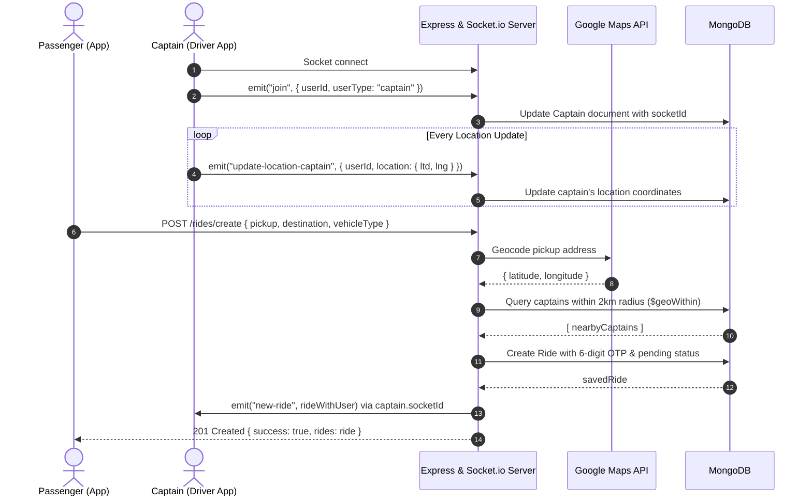

# Uber Clone - Backend API Documentation

A scalable, secure RESTful API and real-time event system built with **Node.js**, **Express.js (v5)**, **MongoDB (Mongoose v9)**, and **Socket.io** powering the Uber clone application. Features dual authentication for passengers and captains (drivers), real-time driver tracking, geolocation & Google Maps integration, dynamic fare estimation, and real-time ride request dispatching to nearby drivers.

---

## 📑 Table of Contents

- [Tech Stack](#-tech-stack)
- [Project Architecture](#-project-architecture)
- [Getting Started](#-getting-started)
  - [Prerequisites & Environment Variables](#prerequisites--environment-variables)
  - [Installation & Running](#installation--running)
- [Authentication & Security](#-authentication--security)
  - [Token Storage & Transmission](#token-storage--transmission)
  - [Token Blacklisting](#token-blacklisting)
  - [Auth Middleware (`authUser`)](#auth-middleware-authuser)
- [Fare Calculation Formula](#-fare-calculation-formula)
- [Endpoints Summary](#-endpoints-summary)
- [Detailed API Reference](#-detailed-api-reference)
  - [1. Health Check](#1-health-check)
    - [GET /](#get-)
  - [2. User Endpoints (`/user`)](#2-user-endpoints-user)
    - [POST /user/register](#post-userregister)
    - [POST /user/login](#post-userlogin)
    - [GET /user/profile](#get-userprofile)
    - [POST /user/logout](#post-userlogout)
  - [3. Captain Endpoints (`/captain`)](#3-captain-endpoints-captain)
    - [POST /captain/register](#post-captainregister)
    - [POST /captain/login](#post-captainlogin)
    - [GET /captain/profile](#get-captainprofile)
    - [POST /captain/logout](#post-captainlogout)
  - [4. Maps Endpoints (`/maps`)](#4-maps-endpoints-maps)
    - [GET /maps/get-coordinates](#get-mapsget-coordinates)
    - [GET /maps/get-distance](#get-mapsget-distance)
    - [GET /maps/get-auto-complete-suggestions](#get-mapsget-auto-complete-suggestions)
  - [5. Ride Endpoints (`/rides`)](#5-ride-endpoints-rides)
    - [GET /rides/get-fare](#get-ridesget-fare)
    - [POST /rides/create](#post-ridescreate)
- [⚡ Real-Time WebSockets (Socket.io)](#-real-time-websockets-socketio)
  - [Socket Server Configuration](#socket-server-configuration)
  - [Socket Events Architecture](#socket-events-architecture)
  - [Real-Time Ride Dispatch Workflow](#real-time-ride-dispatch-workflow)
- [🗄️ Data Models](#-data-models)
  - [User Model](#user-model)
  - [Captain Model](#captain-model)
  - [Ride Model](#ride-model)
  - [BlacklistToken Model](#blacklisttoken-model)
- [🧪 Testing with cURL & WebSockets](#-testing-with-curl--websockets)
  - [HTTP Requests](#http-requests)
  - [WebSocket Client Example](#websocket-client-example)

---

## 🛠️ Tech Stack

- **Runtime:** Node.js (ES Modules)
- **Framework:** Express.js (v5.2.1)
- **Database:** MongoDB via Mongoose (v9.10.1)
- **Real-Time Engine:** Socket.io (v4.8.4)
- **Authentication:** JSON Web Tokens (`jsonwebtoken`), Password Hashing (`bcrypt`)
- **Request Validation:** `express-validator` (v7.3.2)
- **External APIs:** Google Maps API (Geocoding API, Distance Matrix API, Places Autocomplete API) via `axios`
- **HTTP & Server Utilities:** `cookie-parser`, `cors`, `dotenv`

---

## 📁 Project Architecture

```text
backend/
├── .env                          # Environment variables
├── package.json                  # Dependencies & scripts
├── server.js                     # HTTP & Socket.io server entrypoint
└── src/
    ├── app.js                    # Express app configuration, CORS, routes & DNS setup
    ├── socket.js                 # Socket.io initialization, events & message dispatchers
    ├── controllers/
    │   ├── captain.controller.js # Captain register, login, profile, logout handlers
    │   ├── maps.controller.js    # Coordinates, distance, autocomplete handlers
    │   ├── ride.controller.js    # Create ride (with socket dispatch) & fare calculation
    │   └── user.controller.js    # User register, login, profile, logout handlers
    ├── db/
    │   └── db.js                 # Mongoose database connection
    ├── middlewares/
    │   └── middleware.user.js    # authUser JWT & blacklist verification middleware
    ├── models/
    │   ├── blacklistToken.model.js # Revoked JWTs with 24h MongoDB TTL index
    │   ├── captain.model.js      # Captain schema, location coords, vehicle & auth methods
    │   ├── ride.model.js         # Ride booking schema & status state machine
    │   └── user.model.js         # User schema & auth methods
    ├── routes/
    │   ├── captain.route.js      # /captain endpoints & express-validator rules
    │   ├── maps.routes.js        # /maps endpoints & validation rules
    │   ├── ride.route.js         # /rides endpoints & validation rules
    │   └── user.route.js         # /user endpoints & validation rules
    └── services/
        ├── captain.service.js    # Captain creation service
        ├── maps.service.js       # Google Geocoding, Distance Matrix, Autocomplete & Geo-radius lookup
        ├── ride.service.js       # Ride creation, 6-digit OTP generation & fare calculation
        └── user.service.js       # User creation service
```

---

## 🚀 Getting Started

### Prerequisites & Environment Variables

Create a `.env` file in the `backend/` root directory:

```env
PORT=3000
MONGO_URI=mongodb+srv://<username>:<password>@cluster0.mongodb.net/uber
JWT=your_super_secret_jwt_key
GOOGLE_MAPS_API=AIzaSyYourGoogleMapsApiKey
```

> **Note on Google Maps API:** Your API key must have the following Google Cloud APIs enabled:
> 1. **Geocoding API** (for coordinates lookup)
> 2. **Distance Matrix API** (for road distance & duration computation)
> 3. **Places API (New or Legacy Place Autocomplete)** (for place search suggestions)

### Installation & Running

```bash
# Navigate to backend directory
cd backend

# Install dependencies
npm install

# Run development server with nodemon
npm run dev
```

- **Default Server Port:** `3001` (or the configured `PORT` in `.env`)
- **CORS Allowed Origins:**
  - `http://localhost:5173`
  - `https://373wcwgx-5173.inc1.devtunnels.ms`
  - Credentials supported (`credentials: true`)

---

## 🔐 Authentication & Security

### Token Storage & Transmission
- **Token Type:** JSON Web Token (JWT) signed with `process.env.JWT`.
- **Token Expiration:** 24 hours (`expiresIn: "24h"`).
- **Dual Extraction:** Protected endpoints accept authentication via either:
  1. **HTTP-only Cookie:** `token` (automatically set on registration & login with `httpOnly: true`, `secure: true`, `sameSite: "strict"`, `maxAge: 24h`).
  2. **Authorization Header:** `Authorization: Bearer <token>`

### Token Blacklisting
Upon calling `/user/logout` or `/captain/logout`, the current token is inserted into the `blacklistTokens` collection with a 1-day MongoDB TTL index (`expires: "1d"`). Once blacklisted, subsequent requests using this token are rejected immediately.

### Auth Middleware (`authUser`)
Located in `src/middlewares/middleware.user.js`:
1. Extracts token from `req.headers.authorization?.split(' ')[1]` or `req.cookies?.token`.
2. Rejects with `401 Unauthorized` if token is missing.
3. Checks `blacklistToken` collection; rejects with `401 Unauthorized` if blacklisted.
4. Verifies JWT signature using `process.env.JWT`.
5. If invalid or expired, catches `JsonWebTokenError` / `TokenExpiredError` and responds with `401 Unauthorized: Invalid or expired token`.
6. Attaches decoded token payload `{ _id, iat, exp }` to `req.user` and calls `next()`.

---

## 💰 Fare Calculation Formula

Ride fares are calculated dynamically using Google Distance Matrix API based on distance (km) and travel duration (minutes):

$$\text{Fare} = \text{Base Fare} + (\text{Distance in km} \times \text{Per-Km Rate}) + (\text{Duration in minutes} \times \text{Per-Minute Rate})$$

| Vehicle Type | Base Fare (₹) | Rate / Km (₹) | Rate / Minute (₹) |
| :--- | :---: | :---: | :---: |
| **auto** | 20 | 5 | 0.5 |
| **car** | 35 | 8 | 1.0 |
| **moto** | 15 | 4 | 0.5 |

*Fares are rounded to the nearest integer using `Math.round()`.*

---

## 📋 Endpoints Summary

### General
| Method | Endpoint | Access | Description |
|---|---|---|---|
| `GET` | `/` | Public | Server health check status |

### User Endpoints (`/user`)
| Method | Endpoint | Access | Description |
|---|---|---|---|
| `POST` | `/user/register` | Public | Register new user, hash password, return token & set cookie |
| `POST` | `/user/login` | Public | Authenticate user, return token & set cookie |
| `GET` | `/user/profile` | Protected (`authUser`) | Fetch authenticated user ID (`{ user: req.user._id }`) |
| `POST` | `/user/logout` | Protected (`authUser`) | Clear auth cookie and blacklist JWT token |

### Captain Endpoints (`/captain`)
| Method | Endpoint | Access | Description |
|---|---|---|---|
| `POST` | `/captain/register` | Public | Register new captain with vehicle, return token & set cookie |
| `POST` | `/captain/login` | Public | Authenticate captain, return token & set cookie |
| `GET` | `/captain/profile` | Protected (`authUser`) | Fetch authenticated captain ID (`{ captain: req.user._id }`) |
| `POST` | `/captain/logout` | Protected (`authUser`) | Clear auth cookie and blacklist JWT token |

### Maps Endpoints (`/maps`)
| Method | Endpoint | Access | Description |
|---|---|---|---|
| `GET` | `/maps/get-coordinates` | Protected (`authUser`) | Geocode address to latitude & longitude |
| `GET` | `/maps/get-distance` | Protected (`authUser`) | Compute road distance & duration between origin and destination |
| `GET` | `/maps/get-auto-complete-suggestions` | Protected (`authUser`) | Search autocomplete predictions for location search input |

### Ride Endpoints (`/rides`)
| Method | Endpoint | Access | Description |
|---|---|---|---|
| `GET` | `/rides/get-fare` | Protected (`authUser`) | Calculate fares across `auto`, `car`, and `moto` |
| `POST` | `/rides/create` | Protected (`authUser`) | Create ride booking, generate OTP, find captains within 2km & emit `new-ride` socket event |

---

## 📖 Detailed API Reference

### 1. Health Check

#### GET `/`
Checks if the backend server is operational.

- **Access:** Public
- **Response `200 OK`:**
  ```text
  Server is running
  ```

---

### 2. User Endpoints (`/user`)

#### POST `/user/register`
Creates a new passenger account, generates password hash with bcrypt, sets HTTP-only cookie, and returns user details with auth token.

- **Access:** Public
- **Validation Rules:**
  - `fullname.firstname`: Required, string, 3–20 characters.
  - `fullname.lastname`: Optional (max 20 characters).
  - `email`: Required, valid email format, 5–30 characters, must be unique.
  - `password`: Required, min 6 characters (max 80).
- **Request Body:**
  ```json
  {
    "fullname": {
      "firstname": "John",
      "lastname": "Doe"
    },
    "email": "john.doe@example.com",
    "password": "securePassword123"
  }
  ```
- **Response `201 Created`:**
  ```json
  {
    "success": true,
    "message": "User created successfully",
    "user": {
      "_id": "674ef1a2b3c4d5e6f7a8b901",
      "fullname": {
        "firstname": "John",
        "lastname": "Doe"
      },
      "email": "john.doe@example.com"
    },
    "token": "eyJhbGciOiJIUzI1NiIsInR5cCI6IkpXVCJ9..."
  }
  ```
- **Error Responses:**
  - `409 Conflict`: `{"success": false, "message": "User already exists"}`
  - `500 Internal Server Error`: `{"message": "First name must be at least 3 characters long"}`

---

#### POST `/user/login`
Authenticates an existing user via email and password, creates a 24h JWT, and sets an HTTP-only cookie.

- **Access:** Public
- **Validation Rules:**
  - `email`: Required, valid email, 5–30 characters.
  - `password`: Required, 6–80 characters.
- **Request Body:**
  ```json
  {
    "email": "john.doe@example.com",
    "password": "securePassword123"
  }
  ```
- **Response `201 Created`:**
  ```json
  {
    "success": true,
    "message": "User logged in successfully",
    "user": {
      "_id": "674ef1a2b3c4d5e6f7a8b901",
      "fullname": {
        "firstname": "John",
        "lastname": "Doe"
      },
      "email": "john.doe@example.com"
    },
    "token": "eyJhbGciOiJIUzI1NiIsInR5cCI6IkpXVCJ9..."
  }
  ```
- **Error Responses:**
  - `400 Bad Request`: `{"success": false, "message": "Invalid email or password"}`
  - `401 Unauthorized`: `{"success": false, "message": "Invalid email or password"}`

---

#### GET `/user/profile`
Fetches the authenticated user ID from the decoded JWT payload (`req.user._id`).

- **Access:** Protected (`authUser` middleware)
- **Headers / Cookies:**
  - `Authorization: Bearer <token>` OR `Cookie: token=<token>`
- **Response `200 OK`:**
  ```json
  {
    "user": "674ef1a2b3c4d5e6f7a8b901"
  }
  ```
- **Error Responses:**
  - `401 Unauthorized`: `{"message": "Unauthorized"}` or `{"message": "Unauthorized: Invalid or expired token"}`

---

#### POST `/user/logout`
Logs out user by clearing the `token` cookie and saving the JWT into the blacklist collection.

- **Access:** Protected (`authUser` middleware)
- **Headers / Cookies:**
  - `Authorization: Bearer <token>` OR `Cookie: token=<token>`
- **Response `200 OK`:**
  ```json
  {
    "success": true,
    "message": "User logged out successfully"
  }
  ```

---

### 3. Captain Endpoints (`/captain`)

#### POST `/captain/register`
Registers a new captain (driver) account with vehicle details.

- **Access:** Public
- **Validation Rules:**
  - `fullname.firstname`: Required, string, 3–20 characters.
  - `fullname.lastname`: Optional (max 20 characters).
  - `email`: Required, valid email format, 5–30 characters, must be unique.
  - `password`: Required, min 6 characters (max 80).
  - `status`: Required, string, 3–20 characters (`'active'` or `'inactive'`).
  - `vehicle.color`: Required, min 3 characters (max 20).
  - `vehicle.plate`: Required, min 3 characters (max 20).
  - `vehicle.capacity`: Required, integer, min 1.
  - `vehicle.vehicleType`: Required, string, min 3 characters (max 20) (schema enum: `['car', 'motorcycle', 'auto']`).
- **Request Body:**
  ```json
  {
    "fullname": {
      "firstname": "Alex",
      "lastname": "Driver"
    },
    "email": "alex.driver@example.com",
    "password": "driverSecret123",
    "status": "inactive",
    "vehicle": {
      "color": "White",
      "plate": "DL 01 AB 9876",
      "capacity": 4,
      "vehicleType": "car"
    }
  }
  ```
- **Response `201 Created`:**
  ```json
  {
    "success": true,
    "message": "Captain created successfully",
    "captain": {
      "_id": "674ef1a2b3c4d5e6f7a8b902",
      "fullname": {
        "firstname": "Alex",
        "lastname": "Driver"
      },
      "email": "alex.driver@example.com",
      "status": "inactive",
      "vehicle": {
        "color": "White",
        "plate": "DL 01 AB 9876",
        "capacity": 4,
        "vehicleType": "car"
      }
    },
    "token": "eyJhbGciOiJIUzI1NiIsInR5cCI6IkpXVCJ9..."
  }
  ```
- **Error Responses:**
  - `400 Bad Request`: `{"message": "Captain already exists"}`
  - `500 Internal Server Error`: `{"message": "Validation error message"}`

---

#### POST `/captain/login`
Authenticates a captain using email and password, generates a 24h JWT, and sets an HTTP-only cookie.

- **Access:** Public
- **Validation Rules:**
  - `email`: Required, valid email, 5–30 characters.
  - `password`: Required, 6–80 characters.
- **Request Body:**
  ```json
  {
    "email": "alex.driver@example.com",
    "password": "driverSecret123"
  }
  ```
- **Response `201 Created`:**
  ```json
  {
    "success": true,
    "message": "Captain logged in successfully",
    "captain": {
      "_id": "674ef1a2b3c4d5e6f7a8b902",
      "fullname": {
        "firstname": "Alex",
        "lastname": "Driver"
      },
      "email": "alex.driver@example.com",
      "status": "inactive",
      "vehicle": {
        "color": "White",
        "plate": "DL 01 AB 9876",
        "capacity": 4,
        "vehicleType": "car"
      }
    },
    "token": "eyJhbGciOiJIUzI1NiIsInR5cCI6IkpXVCJ9..."
  }
  ```
- **Error Responses:**
  - `400 Bad Request`: `{"success": false, "message": "Invalid email or password"}`
  - `401 Unauthorized`: `{"success": false, "message": "Invalid email or password"}`

---

#### GET `/captain/profile`
Fetches the authenticated captain ID from the decoded JWT payload (`req.user._id`).

- **Access:** Protected (`authUser` middleware)
- **Headers / Cookies:**
  - `Authorization: Bearer <token>` OR `Cookie: token=<token>`
- **Response `200 OK`:**
  ```json
  {
    "captain": "674ef1a2b3c4d5e6f7a8b902"
  }
  ```
- **Error Responses:**
  - `401 Unauthorized`: `{"message": "Unauthorized"}` or `{"message": "Unauthorized: Invalid or expired token"}`

---

#### POST `/captain/logout`
Logs out captain by clearing `token` cookie and blacklisting JWT.

- **Access:** Protected (`authUser` middleware)
- **Headers / Cookies:**
  - `Authorization: Bearer <token>` OR `Cookie: token=<token>`
- **Response `200 OK`:**
  ```json
  {
    "success": true,
    "message": "User logged out successfully"
  }
  ```

---

### 4. Maps Endpoints (`/maps`)

All maps endpoints require authentication via `authUser` middleware (`Cookie: token` or `Authorization: Bearer <token>`).

#### GET `/maps/get-coordinates`
Geocodes an address string to latitude and longitude using Google Geocoding API.

- **Access:** Protected (`authUser`)
- **Query Parameters:**
  - `address` (string, min 3 characters, required)
- **Example Request:**
  ```http
  GET /maps/get-coordinates?address=India+Gate+New+Delhi
  Authorization: Bearer <token>
  ```
- **Response `200 OK`:**
  ```json
  {
    "latitude": 28.612912,
    "longitude": 77.2295097
  }
  ```
- **Error Responses:**
  - `400 Bad Request`: Validation failure on missing or short address:
    ```json
    {
      "errors": [
        {
          "type": "field",
          "value": "",
          "msg": "Invalid value",
          "path": "address",
          "location": "query"
        }
      ]
    }
    ```
  - `404 Not Found`: `{"message": "Coordinates not found"}`

---

#### GET `/maps/get-distance`
Computes road travel distance and duration between two locations using Google Distance Matrix API.

- **Access:** Protected (`authUser`)
- **Query Parameters:**
  - `origin` (string, required)
  - `destination` (string, required)
- **Example Request:**
  ```http
  GET /maps/get-distance?origin=Connaught+Place+Delhi&destination=IGI+Airport+Delhi
  Authorization: Bearer <token>
  ```
- **Response `200 OK`:**
  ```json
  {
    "distance": {
      "text": "16.8 km",
      "value": 16824
    },
    "duration": {
      "text": "34 mins",
      "value": 2045
    },
    "status": "OK"
  }
  ```
- **Error Responses:**
  - `400 Bad Request`: Missing query parameters.
  - `404 Not Found`: `{"message": "Distance not found"}`

---

#### GET `/maps/get-auto-complete-suggestions`
Retrieves location autocomplete suggestions for search inputs using Google Places Autocomplete API.

- **Access:** Protected (`authUser`)
- **Query Parameters:**
  - `input` (string, min 1 character, required)
- **Example Request:**
  ```http
  GET /maps/get-auto-complete-suggestions?input=Aerocity
  Authorization: Bearer <token>
  ```
- **Response `200 OK`:**
  ```json
  [
    {
      "description": "Aerocity, New Delhi, Delhi, India",
      "place_id": "ChIJAw_bVdMYDTkR5bKzU9hC1gU",
      "matched_substrings": [
        {
          "length": 8,
          "offset": 0
        }
      ],
      "structured_formatting": {
        "main_text": "Aerocity",
        "secondary_text": "New Delhi, Delhi, India"
      }
    }
  ]
  ```
- **Error Responses:**
  - `400 Bad Request`: Validation failure.
  - `404 Not Found`: `{"message": "Suggestions not found"}`

---

### 5. Ride Endpoints (`/rides`)

#### GET `/rides/get-fare`
Calculates estimated fares across all supported vehicle categories (`auto`, `car`, `moto`) between pickup and destination.

- **Access:** Protected (`authUser`)
- **Query Parameters:**
  - `pickup` (string, min 3 characters, required)
  - `destination` (string, min 3 characters, required)
- **Example Request:**
  ```http
  GET /rides/get-fare?pickup=Connaught+Place+Delhi&destination=Indira+Gandhi+International+Airport
  Authorization: Bearer <token>
  ```
- **Response `200 OK`:**
  ```json
  {
    "success": true,
    "message": "Fare fetched successfully",
    "fares": {
      "auto": 121,
      "car": 204,
      "moto": 99
    }
  }
  ```
- **Error Responses:**
  - `400 Bad Request`: Validation failure:
    ```json
    {
      "success": false,
      "message": "Invalid input",
      "errors": [
        {
          "type": "field",
          "msg": "Invalid pickup address",
          "path": "pickup",
          "location": "query"
        }
      ]
    }
    ```
  - `500 Internal Server Error`: `{"message": "No routes found"}` or distance calculation failure.

---

#### POST `/rides/create`
Initiates a new ride request, calculates fare, generates a 6-digit OTP, locates captains within a 2 km radius, and broadcasts the ride to captains in real time via Socket.io.

- **Access:** Protected (`authUser`)
- **Validation Rules:**
  - `pickup`: Required, string, 3–200 characters.
  - `destination`: Required, string, 3–200 characters.
  - `vehicleType`: Required, string, 3–20 characters (`"auto"`, `"car"`, or `"moto"`).
- **Ride Creation & Dispatch Workflow:**
  1. Validates request body fields with `express-validator`.
  2. Computes the fare via `getFare({ pickup, destination })`.
  3. Generates a cryptographically secure 6-digit numeric OTP using `crypto.randomInt()`.
  4. Saves the ride in MongoDB with `status: 'pending'`, `user: req.user`, and the assigned fare.
  5. Geocodes `pickup` address into coordinates via `getAddressCoordinate(pickup)`.
  6. Finds all captains within a **2 km radius** using MongoDB `$geoWithin` with spherical center:
     $$\text{Angular Distance} = \frac{2 \text{ km}}{6371 \text{ km}}$$
  7. Populates the passenger details (`user`) on the ride document.
  8. Clears the OTP (`ride.otp = ''`) to ensure security.
  9. Emits a real-time `'new-ride'` Socket.io event to every nearby captain's `socketId`.
  10. Responds with status `201 Created`.
- **Request Body:**
  ```json
  {
    "pickup": "Connaught Place, New Delhi",
    "destination": "Indira Gandhi International Airport, New Delhi",
    "vehicleType": "car"
  }
  ```
- **Response `201 Created`:**
  ```json
  {
    "success": true,
    "message": "Ride created successfully",
    "rides": {
      "_id": "674ef3c5b3c4d5e6f7a8b955",
      "user": {
        "_id": "674ef1a2b3c4d5e6f7a8b901",
        "iat": 1733224800,
        "exp": 1733311200
      },
      "pickup": "Connaught Place, New Delhi",
      "destination": "Indira Gandhi International Airport, New Delhi",
      "vehicleType": "car",
      "fare": 204,
      "status": "pending",
      "otp": ""
    }
  }
  ```
- **Error Responses:**
  - `400 Bad Request`: Validation failure:
    ```json
    {
      "success": false,
      "message": "Invalid input",
      "errors": [
        {
          "type": "field",
          "value": "",
          "msg": "Pickup must be at least 3 characters long",
          "path": "pickup",
          "location": "body"
        }
      ]
    }
    ```
  - `401 Unauthorized`: Missing or invalid auth token.
  - `500 Internal Server Error`: `{"message": "Could not calculate fare"}`

---

## ⚡ Real-Time WebSockets (Socket.io)

The backend provides a real-time event-driven WebSocket layer via **Socket.io** attached directly to the Express HTTP server in `server.js`.

### Socket Server Configuration
- **Entrypoint:** `src/socket.js`
- **Initialized In:** `server.js` (`initializeSocket(server)`)
- **CORS Allowed Origins:**
  - `http://localhost:5173`
  - `https://373wcwgx-5173.inc1.devtunnels.ms`
- **Supported Transports & Methods:** `GET`, `POST` with credentials enabled.
- **Exported Dispatcher Helper:** `sendMessageToSocketId(socketId, messageObject)`

### Socket Events Architecture

| Event | Direction | Payload | Description |
|---|---|---|---|
| `connection` | Server &larr; Client | - | Triggered automatically when client establishes WebSocket connection |
| `join` | Server &larr; Client | `{ userId: string, userType: 'user' \| 'captain' }` | Maps and persists the active `socket.id` on the corresponding User or Captain document in MongoDB |
| `update-location-captain` | Server &larr; Client | `{ userId: string, location: { ltd: number, lng: number } }` | Updates captain's current real-time GPS coordinates in MongoDB (`location.ltd`, `location.lng`) |
| `new-ride` | Server &rarr; Client | Populated Ride Document (`rideWithUser`) | Emitted by server to all captains within 2km radius of pickup location when a ride is created |
| `error` | Server &rarr; Client | `{ message: 'Invalid location' }` | Emitted back to captain client if location payload in `update-location-captain` is invalid or missing |
| `disconnect` | Server &larr; Client | - | Triggered when client connection is closed |

### Real-Time Ride Dispatch Workflow



---

## 🗄️ Data Models

### User Model
Defined in `src/models/user.model.js` (`collection: users`):

| Field | Type | Attributes | Description |
|---|---|---|---|
| `fullname.firstname` | `String` | Required, trim, min 3, max 20 | Passenger first name |
| `fullname.lastname` | `String` | Optional, trim, max 20 | Passenger last name |
| `email` | `String` | Required, unique, trim, min 5, max 30, email regex | Passenger email address |
| `password` | `String` | Required, trim, min 6, max 80, `select: false` | Bcrypt hashed password |
| `socketId` | `String` | Optional | Active WebSocket socket ID |

**Methods:**
- `userSchema.statics.generateHashPassword(password)`: Hashes password with bcrypt (salt 10).
- `userSchema.methods.comparePassword(password)`: Compares plaintext password against hash.
- `userSchema.methods.generateAuthToken()`: Signs and returns a 24-hour JWT with payload `{ _id }`.

---

### Captain Model
Defined in `src/models/captain.model.js` (`collection: captains`):

| Field | Type | Attributes | Description |
|---|---|---|---|
| `fullname.firstname` | `String` | Required, trim, min 3, max 20 | Driver first name |
| `fullname.lastname` | `String` | Optional, trim, max 20 | Driver last name |
| `email` | `String` | Required, unique, trim, min 5, max 30, email regex | Driver email address |
| `password` | `String` | Required, trim, min 6, max 80, `select: false` | Bcrypt hashed password |
| `socketId` | `String` | Optional | Active WebSocket socket ID |
| `status` | `String` | Enum: `['active', 'inactive']`, default `'inactive'` | Availability status |
| `vehicle.color` | `String` | Required, min 3 | Vehicle exterior color |
| `vehicle.plate` | `String` | Required, min 3 | Vehicle license plate number |
| `vehicle.capacity` | `Number` | Required, min 1 | Passenger seating capacity |
| `vehicle.vehicleType` | `String` | Required, enum: `['car', 'motorcycle', 'auto']` | Vehicle category |
| `location.ltd` | `Number` | Optional | Current real-time latitude |
| `location.lng` | `Number` | Optional | Current real-time longitude |

**Methods:**
- `captainSchema.statics.generateHashPassword(password)`: Hashes password with bcrypt (salt 10).
- `captainSchema.methods.comparePassword(password)`: Compares plaintext against hash.
- `captainSchema.methods.generateAuthToken()`: Signs and returns a 24-hour JWT with payload `{ _id }`.

---

### Ride Model
Defined in `src/models/ride.model.js` (`collection: rides`):

| Field | Type | Attributes | Description |
|---|---|---|---|
| `user` | `ObjectId` | Required, ref: `'user'` | Passenger reference |
| `captain` | `ObjectId` | Optional, ref: `'captain'` | Assigned driver reference |
| `pickup` | `String` | Required | Origin address |
| `destination` | `String` | Required | Destination address |
| `fare` | `Number` | Required | Trip fare in INR |
| `status` | `String` | Enum: `['pending', 'accepted', 'ongoing', 'completed', 'cancelled']`, default `'pending'` | Current ride booking status |
| `vehicleType` | `String` | Required, enum: `['auto', 'car', 'moto']` | Selected vehicle category |
| `distance` | `Number` | Optional | Distance in meters |
| `duration` | `Number` | Optional | Duration in seconds |
| `paymentID` | `String` | Optional | Payment gateway transaction ID |
| `orderID` | `String` | Optional | Order ID |
| `signature` | `String` | Optional | Payment verification signature |
| `otp` | `String` | Required, `select: false` | 6-digit verification code |

---

### BlacklistToken Model
Defined in `src/models/blacklistToken.model.js` (`collection: blacklisttokens`):

| Field | Type | Attributes | Description |
|---|---|---|---|
| `token` | `String` | Required, trim | Blacklisted JWT token string |
| `createdAt` | `Date` | Default: `Date.now`, `expires: "1d"` | MongoDB TTL index; document auto-deleted after 24h |

---

## 🧪 Testing with cURL & WebSockets

### HTTP Requests

#### 1. Register User
```bash
curl -X POST http://localhost:3000/user/register \
  -H "Content-Type: application/json" \
  -d '{
    "fullname": { "firstname": "John", "lastname": "Doe" },
    "email": "john@example.com",
    "password": "password123"
  }'
```

#### 2. Login User
```bash
curl -X POST http://localhost:3000/user/login \
  -H "Content-Type: application/json" \
  -d '{
    "email": "john@example.com",
    "password": "password123"
  }'
```

#### 3. Get User Profile
```bash
curl -X GET http://localhost:3000/user/profile \
  -H "Authorization: Bearer <USER_JWT_TOKEN>"
```

#### 4. Register Captain
```bash
curl -X POST http://localhost:3000/captain/register \
  -H "Content-Type: application/json" \
  -d '{
    "fullname": { "firstname": "Alex", "lastname": "Driver" },
    "email": "alex@example.com",
    "password": "password123",
    "status": "active",
    "vehicle": {
      "color": "White",
      "plate": "DL01AB1234",
      "capacity": 4,
      "vehicleType": "car"
    }
  }'
```

#### 5. Get Captain Profile
```bash
curl -X GET http://localhost:3000/captain/profile \
  -H "Authorization: Bearer <CAPTAIN_JWT_TOKEN>"
```

#### 6. Geocode Address
```bash
curl -X GET "http://localhost:3000/maps/get-coordinates?address=India+Gate+New+Delhi" \
  -H "Authorization: Bearer <JWT_TOKEN>"
```

#### 7. Calculate Fare
```bash
curl -X GET "http://localhost:3000/rides/get-fare?pickup=Connaught%20Place%20Delhi&destination=Noida%20Sector%2062" \
  -H "Authorization: Bearer <JWT_TOKEN>"
```

#### 8. Create Ride & Dispatch to Captains
```bash
curl -X POST http://localhost:3000/rides/create \
  -H "Content-Type: application/json" \
  -H "Authorization: Bearer <USER_JWT_TOKEN>" \
  -d '{
    "pickup": "Connaught Place Delhi",
    "destination": "Noida Sector 62",
    "vehicleType": "car"
  }'
```

#### 9. Logout
```bash
curl -X POST http://localhost:3000/user/logout \
  -H "Authorization: Bearer <JWT_TOKEN>"
```

---

### WebSocket Client Example

Using `socket.io-client` in JavaScript:

```javascript
import { io } from "socket.io-client";

// Connect to backend
const socket = io("http://localhost:3000", {
  withCredentials: true,
});

// 1. Join room and map socketId in database
socket.emit("join", {
  userId: "674ef1a2b3c4d5e6f7a8b902", // Captain or User MongoDB _id
  userType: "captain"                 // "user" or "captain"
});

// 2. Captain updates GPS location periodically
socket.emit("update-location-captain", {
  userId: "674ef1a2b3c4d5e6f7a8b902",
  location: {
    ltd: 28.6139,
    lng: 77.2090
  }
});

// 3. Captain listens for incoming ride requests within 2km
socket.on("new-ride", (rideData) => {
  console.log("New ride request received:", rideData);
  // rideData contains populated user details and sanitized otp
});

// 4. Listen for errors
socket.on("error", (err) => {
  console.error("Socket error:", err.message);
});
```
